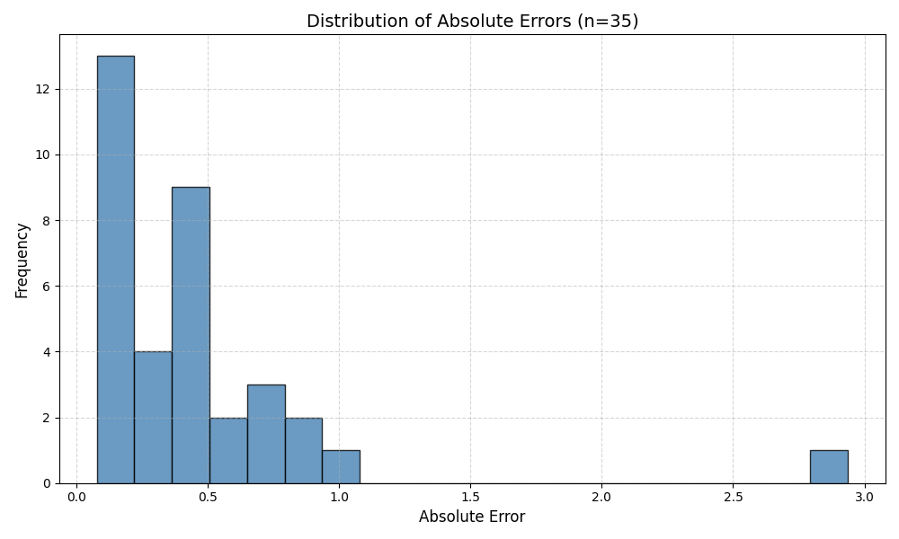

# ML Model Monitoring — Microservice Architecture

## Введение

Микросервисная архитектура в машинном обучении решает несколько ключевых задач:

- изолированное развертывание отдельных компонентов (генерация данных, инференс модели, метрики, визуализация);
- независимые зависимости и версии библиотек для каждого сервиса;
- масштабирование по частям (например, увеличивать только мощность инференса);
- устойчивость к сбоям: падение одного сервиса не блокирует всю систему, если есть очереди сообщений.

В проекте симулируется потоковая ML-система с обменом данными через RabbitMQ и оркестрацией контейнеров через Docker Compose. Каждый сервис находится в отдельной папке, со своим Dockerfile, собственной логикой и точкой входа.

В качестве исходного набора данных используется датасет **California Housing** из библиотеки scikit-learn.

**Ключевая идея:** слабая связность сервисов достигается благодаря брокеру сообщений (RabbitMQ) и согласованному форматированию сообщений (очереди, идентификаторы, JSON).

## Архитектура

```
features ──▶ очередь X ──▶ model ──▶ очередь y_pred ──┐
features ──▶ очередь y_true ──────────────────────────┤
                                                        ▼
                                                      metric
                                                        │
                                                        ▼
                                                 metric_log.csv
                                                        │
                                                        ▼
                                                      plot
```

### Сервисы и их назначение

- **features** (генератор данных) — выбирает случайное наблюдение из датасета, формирует X (признаки) и y_true (истинное значение), присваивает уникальный ID и публикует сообщения в две очереди через RabbitMQ.
- **model** (инференс) — подписывается на очередь с признаками (`X`), применяет обученную модель (`LinearRegression`), публикует предсказания y_pred в отдельную очередь с тем же ID.
- **metric** (оценка) — подписывается на очереди `y_true` и `y_pred`, синхронизирует сообщения по общему ID, вычисляет абсолютную ошибку и записывает результат в CSV.
- **plot** (визуализация) — периодически читает CSV из директории `logs/`, строит гистограмму ошибок и сохраняет PNG. Не использует RabbitMQ, работает по файловой модели.

## Структура проекта

```
HW_1/
├── docker-compose.yml
├── requirements.txt             # Общий список зависимостей
├── logs/
│   ├── metric_log.csv           # Создаётся и обновляется в реальном времени
│   └── error_distribution.png  # Генерируется сервисом plot
├── features/
│   ├── features.py
│   ├── Dockerfile
│   └── requirements.txt
├── model/
│   ├── model.py
│   ├── Dockerfile
│   └── requirements.txt
├── metric/
│   ├── metric.py
│   ├── Dockerfile
│   └── requirements.txt
└── plot/
    ├── plot.py
    ├── Dockerfile
    └── requirements.txt
```

## Обмен данными

### Очереди

| Очередь | Отправитель | Получатель | Содержимое |
|---------|-------------|------------|------------|
| `X` | features | model | Вектор признаков |
| `y_true` | features | metric | Истинное значение таргета |
| `y_pred` | model | metric | Предсказание модели |

Названия очередей согласованы между сервисами и объявляются идемпотентно при старте каждого сервиса.

### Формат сообщений

Все сообщения передаются в формате JSON:

```json
{ "id": 1669147134.196809, "body": <значение или список признаков> }
```

### Идентификаторы сообщений

Каждому наблюдению присваивается уникальный ID на основе timestamp:

```python
from datetime import datetime
message_id = datetime.timestamp(datetime.now())
```

ID используется во всех сообщениях одного наблюдения и служит ключом для синхронизации в сервисе metric. Это критично, потому что сообщения из разных очередей могут приходить в разном порядке.

### Задержки и синхронизация

Генератор данных добавляет искусственную задержку (`time.sleep(10)`) между итерациями для наблюдаемости потока. В реальных системах задержки возникают естественно: инференс модели — самый «тормозной» компонент, а сенсоры могут давать данные с рассинхронизацией.

### Формат metric_log.csv

```
id,y_true,y_pred,absolute_error
1669147134.196809,295.0,221.77,73.23
1669147136.824343,153.0,118.44,34.56
```

## Синхронизация потоков

Проблема: сообщения из очередей `y_true` и `y_pred` приходят в разные моменты времени и могут быть «невыравнены».

Решение в сервисе metric — буфер в памяти:

```python
buffer = {
    id1: {"y_true": 150.0, "y_pred": None},
    id2: {"y_true": None,  "y_pred": 147.2}
}
```

Как только для одного ID получены оба значения — вычисляется ошибка, результат записывается в CSV, запись удаляется из буфера. Это общий шаблон для асинхронных ML-пайплайнов.

## Отказоустойчивость

### Docker Compose: depends_on и restart

- `depends_on` с healthcheck задаёт порядок запуска: сервисы стартуют только после того, как RabbitMQ стал готов.
- `restart: on-failure` позволяет автоматически перезапускать сервисы при падениях, что особенно полезно при «гонке» старта контейнеров.

### Двойная защита

Защита реализована на двух уровнях: на уровне Docker (`restart`) и на уровне кода (корректная обработка исключений). Это повышает устойчивость к кратковременным сетевым сбоям и задержкам инициализации.

## Docker: сборка и контейнеризация

### Раздельные Dockerfile

Каждый сервис имеет собственный Dockerfile:

- базовый образ `python:3.10-slim` — облегчённый, без лишних компонентов;
- установка зависимостей из `requirements.txt`;
- копирование кода сервиса;
- команда запуска через `CMD`.

Раздельные Dockerfile позволяют обновлять и масштабировать каждый сервис независимо, а также иметь разные зависимости в реальных проектах.

### Роль pika

`pika` — Python-библиотека для работы с RabbitMQ. Обеспечивает:

- создание соединений и каналов;
- объявление очередей (идемпотентно);
- публикацию и потребление сообщений;
- подтверждения доставки (`basic_ack`);
- колбэки при поступлении новых сообщений.

## Пример сценария работы

1. **features** выбирает наблюдение, присваивает `ID=1669147134.2`, публикует X в очередь `X` и y_true в очередь `y_true`.
2. **model** читает X с `ID=1669147134.2`, делает предсказание через `LinearRegression` и публикует y_pred в очередь `y_pred` с тем же ID.
3. **metric** получает y_true и y_pred, объединяет по ID, вычисляет `|y_true − y_pred|` и дописывает строку в `metric_log.csv`.
4. **plot** через 10 секунд читает CSV, строит гистограмму распределения ошибок, сохраняет `error_distribution.png`.

## Запуск

Требуется установленный Docker и Docker Compose.

```bash
cd HW_1
docker-compose up --build
```

Полезные команды:

```bash
docker-compose logs -f features   # Логи генератора данных
docker-compose logs -f metric     # Логи сервиса метрик
docker-compose logs -f plot       # Логи сервиса визуализации
docker-compose down               # Остановить все сервисы
```

RabbitMQ Management UI доступен по адресу: [http://localhost:15672](http://localhost:15672) (guest / guest)

## Зависимости

| Библиотека | Используется в | Назначение |
|------------|---------------|------------|
| `pika` | features, model, metric | Клиент AMQP для RabbitMQ |
| `scikit-learn` | features, model | Датасет и модель LinearRegression |
| `numpy` | features, model | Работа с массивами признаков |
| `pandas` | plot | Чтение CSV с метриками |
| `matplotlib` | plot | Построение гистограммы ошибок |

## Пример результата

### Гистограмма распределения ошибок

После запуска системы сервис **plot** регулярно обновляет файл `logs/error_distribution.png`. Пример гистограммы на 27 наблюдениях:



Большинство ошибок модели сосредоточено в диапазоне 0.1–1.0 (цена жилья в сотнях тысяч долларов), что соответствует ожидаемому качеству `LinearRegression` на датасете California Housing.

## Итог

Система демонстрирует полный цикл потоковой ML-обработки: генерация признаков → инференс → оценка ошибки → визуализация. Все компоненты разнесены по микросервисам, общение идёт через очереди RabbitMQ, а устойчивость обеспечивается политиками перезапуска Docker и асинхронным буфером в сервисе metric.
